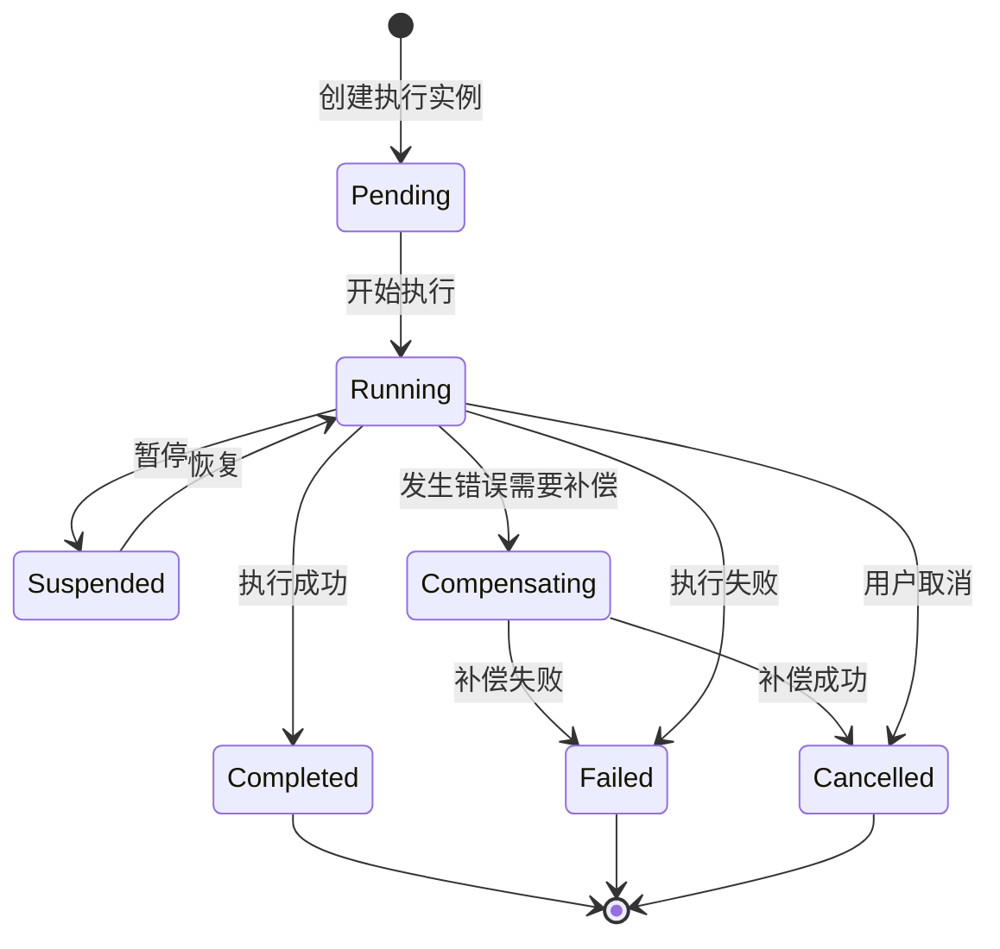

# 工作流引擎与调度器详细设计

## 1. 概述

工作流引擎与调度器是 Agent Workflow Runtime 的核心组件，负责解析、编排和执行智能体工作流。本设计遵循可扩展、高可用、事件驱动的原则，支持复杂的 DAG（有向无环图）和状态机模式。

## 2. 核心概念定义

### 2.1 工作流（Workflow）
- **定义**：描述智能体协作完成任务的流程蓝图
- **类型**：
  - DAG 工作流：基于依赖关系的有向无环图
  - 状态机工作流：基于状态转换的工作流
  - 混合工作流：结合 DAG 和状态机特性

### 2.2 节点（Node）
- **智能体节点**：调用特定智能体执行任务
- **工具节点**：调用外部工具或函数
- **控制节点**：条件判断、循环、分支等控制逻辑
- **聚合节点**：收集并处理多个上游节点的输出

### 2.3 边（Edge）
- **数据流边**：传递数据和上下文
- **控制流边**：传递执行控制权
- **条件边**：基于条件的路由

## 3. 核心模块设计

### 3.1 工作流解析器（Workflow Parser）

```yaml
# 工作流定义示例
workflow:
  id: "customer-support-workflow"
  name: "智能客服工作流"
  version: "1.0.0"
  type: "dag"
  
  nodes:
    - id: "intent-recognition"
      type: "agent"
      agent: "intent-classifier"
      inputs:
        message: "${trigger.message}"
      outputs:
        - intent
        - confidence
    
    - id: "route-decision"
      type: "control"
      subtype: "switch"
      condition: "${intent-recognition.intent}"
      branches:
        - case: "complaint"
          target: "complaint-handler"
        - case: "inquiry"
          target: "inquiry-handler"
        - default: "general-handler"
    
    - id: "complaint-handler"
      type: "agent"
      agent: "complaint-specialist"
      inputs:
        context: "${intent-recognition.output}"
        history: "${session.history}"
  
  edges:
    - from: "start"
      to: "intent-recognition"
    - from: "intent-recognition"
      to: "route-decision"
```

#### 解析器组件：
- **YAML/JSON 解析器**：支持声明式工作流定义
- **DSL 解析器**：支持领域特定语言
- **验证器**：确保工作流定义的合法性
- **优化器**：优化执行路径，识别可并行节点

### 3.2 执行引擎（Execution Engine）

#### 3.2.1 执行器架构

```python
class ExecutionEngine:
    def __init__(self):
        self.scheduler = TaskScheduler()
        self.executor_pool = ExecutorPool()
        self.state_manager = StateManager()
        self.event_bus = EventBus()
    
    async def execute_workflow(self, workflow_id: str, context: Dict):
        """执行工作流主入口"""
        # 1. 加载工作流定义
        workflow = await self.load_workflow(workflow_id)
        
        # 2. 创建执行实例
        execution = WorkflowExecution(
            workflow_id=workflow_id,
            execution_id=generate_id(),
            context=context,
            status=ExecutionStatus.PENDING
        )
        
        # 3. 初始化执行计划
        execution_plan = self.create_execution_plan(workflow, execution)
        
        # 4. 提交到调度器
        await self.scheduler.schedule(execution_plan)
        
        return execution.execution_id
```

#### 3.2.2 执行状态管理

```python
class ExecutionState:
    """工作流执行状态"""
    PENDING = "pending"          # 等待执行
    RUNNING = "running"          # 执行中
    SUSPENDED = "suspended"      # 暂停
    COMPLETED = "completed"      # 完成
    FAILED = "failed"           # 失败
    CANCELLED = "cancelled"      # 取消
    COMPENSATING = "compensating" # 补偿中

class NodeExecutionState:
    """节点执行状态"""
    WAITING = "waiting"          # 等待依赖
    READY = "ready"             # 就绪
    RUNNING = "running"         # 执行中
    SUCCESS = "success"         # 成功
    FAILED = "failed"           # 失败
    SKIPPED = "skipped"         # 跳过
    RETRYING = "retrying"       # 重试中
```

### 3.3 调度器（Scheduler）

#### 3.3.1 调度策略

```python
class TaskScheduler:
    def __init__(self):
        self.ready_queue = PriorityQueue()
        self.waiting_tasks = {}
        self.running_tasks = {}
        self.resource_manager = ResourceManager()
    
    async def schedule(self, execution_plan: ExecutionPlan):
        """主调度循环"""
        # 1. 识别就绪节点
        ready_nodes = self.identify_ready_nodes(execution_plan)
        
        # 2. 资源分配与调度
        for node in ready_nodes:
            if await self.resource_manager.can_allocate(node):
                task = self.create_task(node)
                await self.ready_queue.put(task)
        
        # 3. 执行任务
        while not self.ready_queue.empty():
            task = await self.ready_queue.get()
            await self.execute_task(task)
```

#### 3.3.2 并发控制

```python
class ConcurrencyController:
    def __init__(self, max_concurrent_tasks=100):
        self.semaphore = asyncio.Semaphore(max_concurrent_tasks)
        self.rate_limiters = {}
    
    async def acquire_execution_slot(self, node_type: str):
        """获取执行槽位"""
        # 全局并发控制
        await self.semaphore.acquire()
        
        # 节点类型级别的速率限制
        if node_type in self.rate_limiters:
            await self.rate_limiters[node_type].acquire()
```

### 3.4 状态机服务（State Machine Service）

#### 3.4.1 状态定义

```python
@dataclass
class StateDefinition:
    name: str
    type: StateType  # INITIAL, NORMAL, FINAL
    on_enter: Optional[List[Action]]
    on_exit: Optional[List[Action]]
    transitions: List[Transition]

@dataclass
class Transition:
    event: str
    condition: Optional[str]
    target_state: str
    actions: Optional[List[Action]]
```

#### 3.4.2 状态机引擎

```python
class StateMachineEngine:
    async def process_event(self, machine_id: str, event: Event):
        """处理状态机事件"""
        # 1. 获取当前状态
        current_state = await self.get_current_state(machine_id)
        
        # 2. 查找适用的转换
        transition = self.find_transition(current_state, event)
        
        if transition:
            # 3. 执行退出动作
            await self.execute_actions(current_state.on_exit)
            
            # 4. 执行转换动作
            await self.execute_actions(transition.actions)
            
            # 5. 更新状态
            new_state = transition.target_state
            await self.update_state(machine_id, new_state)
            
            # 6. 执行进入动作
            await self.execute_actions(new_state.on_enter)
```

## 4. 数据模型设计

### 4.1 工作流定义模型

```sql
-- 工作流定义表
CREATE TABLE workflow_definitions (
    id UUID PRIMARY KEY,
    name VARCHAR(255) NOT NULL,
    version VARCHAR(50) NOT NULL,
    type VARCHAR(50) NOT NULL, -- 'dag', 'state_machine', 'hybrid'
    definition JSONB NOT NULL,
    metadata JSONB,
    created_at TIMESTAMP DEFAULT CURRENT_TIMESTAMP,
    updated_at TIMESTAMP DEFAULT CURRENT_TIMESTAMP,
    UNIQUE(name, version)
);

-- 工作流节点定义表
CREATE TABLE workflow_nodes (
    id UUID PRIMARY KEY,
    workflow_id UUID REFERENCES workflow_definitions(id),
    node_id VARCHAR(255) NOT NULL,
    node_type VARCHAR(50) NOT NULL,
    configuration JSONB NOT NULL,
    dependencies JSONB, -- 依赖的节点ID列表
    INDEX idx_workflow_nodes (workflow_id)
);
```

### 4.2 执行实例模型

```sql
-- 工作流执行实例表
CREATE TABLE workflow_executions (
    id UUID PRIMARY KEY,
    workflow_id UUID REFERENCES workflow_definitions(id),
    parent_execution_id UUID, -- 支持子工作流
    status VARCHAR(50) NOT NULL,
    context JSONB,
    start_time TIMESTAMP,
    end_time TIMESTAMP,
    error_message TEXT,
    created_at TIMESTAMP DEFAULT CURRENT_TIMESTAMP,
    INDEX idx_status (status),
    INDEX idx_workflow_id (workflow_id)
);

-- 节点执行实例表
CREATE TABLE node_executions (
    id UUID PRIMARY KEY,
    execution_id UUID REFERENCES workflow_executions(id),
    node_id VARCHAR(255) NOT NULL,
    status VARCHAR(50) NOT NULL,
    input_data JSONB,
    output_data JSONB,
    error_info JSONB,
    retry_count INT DEFAULT 0,
    start_time TIMESTAMP,
    end_time TIMESTAMP,
    INDEX idx_execution_node (execution_id, node_id)
);
```

## 5. API 接口设计

### 5.1 工作流管理 API

```yaml
openapi: 3.0.0
paths:
  /workflows:
    post:
      summary: 创建工作流定义
      requestBody:
        content:
          application/json:
            schema:
              $ref: '#/components/schemas/WorkflowDefinition'
      responses:
        201:
          description: 工作流创建成功
          
  /workflows/{workflowId}/execute:
    post:
      summary: 执行工作流
      parameters:
        - name: workflowId
          in: path
          required: true
          schema:
            type: string
      requestBody:
        content:
          application/json:
            schema:
              type: object
              properties:
                context:
                  type: object
                async:
                  type: boolean
                  default: true
      responses:
        202:
          description: 工作流执行已接受
          content:
            application/json:
              schema:
                type: object
                properties:
                  executionId:
                    type: string
```

### 5.2 执行监控 API

```yaml
  /executions/{executionId}:
    get:
      summary: 获取执行状态
      parameters:
        - name: executionId
          in: path
          required: true
          schema:
            type: string
      responses:
        200:
          description: 执行状态信息
          
  /executions/{executionId}/cancel:
    post:
      summary: 取消执行
      
  /executions/{executionId}/suspend:
    post:
      summary: 暂停执行
      
  /executions/{executionId}/resume:
    post:
      summary: 恢复执行
```

## 6. 执行流程设计

### 6.1 工作流执行生命周期



### 6.2 节点执行流程

```python
async def execute_node(self, node: Node, context: ExecutionContext):
    """节点执行核心流程"""
    try:
        # 1. 前置检查
        await self.pre_execution_check(node, context)
        
        # 2. 准备输入数据
        input_data = await self.prepare_input(node, context)
        
        # 3. 执行节点逻辑
        if node.type == NodeType.AGENT:
            output = await self.execute_agent_node(node, input_data)
        elif node.type == NodeType.TOOL:
            output = await self.execute_tool_node(node, input_data)
        elif node.type == NodeType.CONTROL:
            output = await self.execute_control_node(node, input_data)
        
        # 4. 后置处理
        await self.post_execution_process(node, output, context)
        
        # 5. 更新执行状态
        await self.update_node_status(node.id, NodeExecutionState.SUCCESS)
        
        return output
        
    except Exception as e:
        await self.handle_node_error(node, e, context)
        raise
```

## 7. 高级特性设计

### 7.1 错误处理与恢复

```python
class ErrorHandler:
    async def handle_error(self, node: Node, error: Exception, context: ExecutionContext):
        """统一错误处理"""
        # 1. 记录错误信息
        await self.log_error(node, error)
        
        # 2. 判断错误类型和处理策略
        strategy = self.determine_strategy(node, error)
        
        if strategy == ErrorStrategy.RETRY:
            return await self.retry_node(node, context)
        elif strategy == ErrorStrategy.COMPENSATE:
            return await self.compensate(node, context)
        elif strategy == ErrorStrategy.SKIP:
            return await self.skip_node(node, context)
        else:
            raise WorkflowExecutionError(f"Node {node.id} failed: {error}")
```

### 7.2 动态工作流修改

```python
class DynamicWorkflowModifier:
    async def add_node(self, execution_id: str, node: Node, after: str):
        """动态添加节点"""
        # 1. 验证执行状态允许修改
        # 2. 更新执行计划
        # 3. 重新调度受影响的节点
        
    async def skip_node(self, execution_id: str, node_id: str):
        """跳过节点执行"""
        # 1. 标记节点为跳过状态
        # 2. 触发下游节点评估
```

### 7.3 子工作流支持

```python
class SubWorkflowExecutor:
    async def execute_sub_workflow(self, parent_context: ExecutionContext, 
                                  sub_workflow_id: str, 
                                  input_mapping: Dict):
        """执行子工作流"""
        # 1. 创建子执行上下文
        sub_context = self.create_sub_context(parent_context, input_mapping)
        
        # 2. 执行子工作流
        sub_execution_id = await self.engine.execute_workflow(
            sub_workflow_id, 
            sub_context
        )
        
        # 3. 等待完成并收集结果
        result = await self.wait_for_completion(sub_execution_id)
        
        return result
```

## 8. 性能优化设计

### 8.1 执行计划缓存

```python
class ExecutionPlanCache:
    def __init__(self):
        self.cache = LRUCache(maxsize=1000)
        self.cache_stats = CacheStats()
    
    async def get_or_create_plan(self, workflow_id: str, context: Dict):
        """获取或创建执行计划"""
        cache_key = self.generate_cache_key(workflow_id, context)
        
        if cache_key in self.cache:
            self.cache_stats.hit()
            return self.cache[cache_key]
        
        # 创建新的执行计划
        plan = await self.create_execution_plan(workflow_id, context)
        self.cache[cache_key] = plan
        self.cache_stats.miss()
        
        return plan
```

### 8.2 批量执行优化

```python
class BatchExecutor:
    async def batch_execute_nodes(self, nodes: List[Node], context: ExecutionContext):
        """批量执行同类型节点"""
        # 1. 按类型分组
        grouped = self.group_by_type(nodes)
        
        # 2. 并行批量执行
        tasks = []
        for node_type, batch in grouped.items():
            executor = self.get_executor(node_type)
            task = executor.batch_execute(batch, context)
            tasks.append(task)
        
        # 3. 收集结果
        results = await asyncio.gather(*tasks)
        return self.merge_results(results)
```

## 9. 监控与可观测性

### 9.1 指标收集

```python
class WorkflowMetrics:
    def __init__(self):
        self.execution_counter = Counter('workflow_executions_total')
        self.execution_duration = Histogram('workflow_execution_duration_seconds')
        self.node_execution_duration = Histogram('node_execution_duration_seconds')
        self.error_counter = Counter('workflow_errors_total')
    
    def record_execution_start(self, workflow_id: str):
        self.execution_counter.labels(workflow_id=workflow_id).inc()
    
    def record_execution_complete(self, workflow_id: str, duration: float):
        self.execution_duration.labels(workflow_id=workflow_id).observe(duration)
```

### 9.2 追踪集成

```python
class TracingIntegration:
    async def trace_node_execution(self, node: Node, context: ExecutionContext):
        """节点执行追踪"""
        with self.tracer.start_span(f"node.{node.type}.{node.id}") as span:
            span.set_attribute("node.id", node.id)
            span.set_attribute("node.type", node.type)
            span.set_attribute("execution.id", context.execution_id)
            
            try:
                result = await self.execute_node(node, context)
                span.set_status(Status(StatusCode.OK))
                return result
            except Exception as e:
                span.set_status(Status(StatusCode.ERROR, str(e)))
                raise
```

## 10. 集成接口设计

### 10.1 事件总线集成

```python
class EventBusIntegration:
    async def publish_execution_event(self, event_type: str, payload: Dict):
        """发布执行事件"""
        event = WorkflowEvent(
            type=event_type,
            timestamp=datetime.utcnow(),
            payload=payload
        )
        await self.event_bus.publish("workflow.events", event)
    
    async def subscribe_to_external_events(self):
        """订阅外部事件触发工作流"""
        async for message in self.event_bus.subscribe("external.triggers"):
            await self.handle_trigger_event(message)
```

### 10.2 智能体管理集成

```python
class AgentIntegration:
    async def invoke_agent(self, agent_id: str, input_data: Dict, context: ExecutionContext):
        """调用智能体"""
        # 1. 获取智能体配置
        agent_config = await self.agent_manager.get_agent_config(agent_id)
        
        # 2. 准备智能体上下文
        agent_context = await self.prepare_agent_context(
            agent_config, 
            input_data, 
            context
        )
        
        # 3. 调用智能体
        result = await self.agent_runtime.execute(
            agent_id, 
            agent_context
        )
        
        return result
```

## 11. 部署与运维

### 11.1 容器化部署

```dockerfile
# Dockerfile
FROM python:3.11-slim

WORKDIR /app

COPY requirements.txt .
RUN pip install -r requirements.txt

COPY . .

CMD ["python", "-m", "workflow_engine.server"]
```

### 11.2 健康检查

```python
class HealthCheck:
    async def check_health(self):
        """系统健康检查"""
        checks = {
            "database": await self.check_database(),
            "message_queue": await self.check_message_queue(),
            "cache": await self.check_cache(),
            "agent_runtime": await self.check_agent_runtime()
        }
        
        overall_health = all(checks.values())
        return {
            "status": "healthy" if overall_health else "unhealthy",
            "checks": checks,
            "timestamp": datetime.utcnow().isoformat()
        }
```

## 12. 总结

本设计提供了一个完整的工作流引擎与调度器实现方案，包括：

1. **核心功能**：支持 DAG 和状态机两种工作流模式
2. **高可用性**：通过状态持久化、错误恢复、补偿机制保证可靠性
3. **高性能**：通过执行计划缓存、批量执行、并发控制提升性能
4. **可扩展性**：模块化设计，支持动态扩展和自定义节点类型
5. **可观测性**：完整的监控、追踪和日志体系

该设计为 Agent Workflow Runtime 提供了坚实的执行基础，能够支撑复杂的智能体协作场景。
